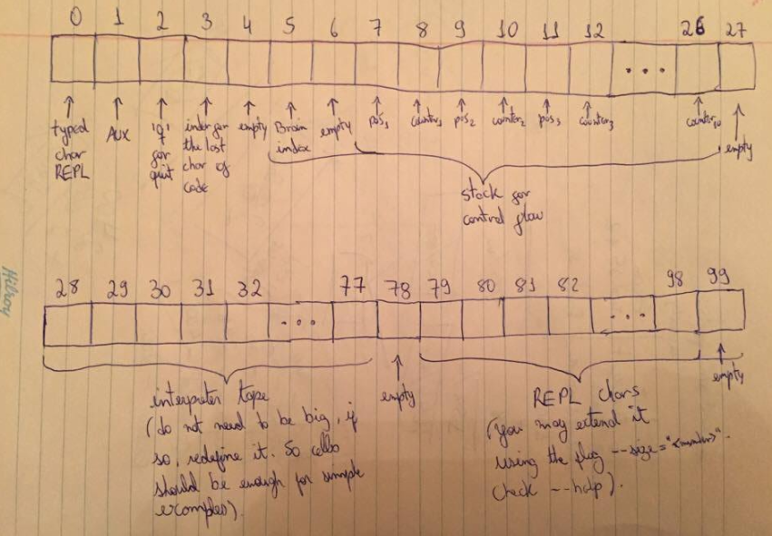

# Brain REPL

> This REPL is written in Brain and comes with ABSOLUTELY NO WARRANTY.

  

### FAQ

-  __How to increase REPL tape size?__
It's simple. When running this REPL, use the command `--size=<desired_number_of_cells>`. Example: `brain repl.brain --io=repl --size=200`. __Important Note__: The default value is `100`, anything more than that will require the compiler to alloc more memory in order to fit your tape. 

- __How to increase inner interpreter tape size?__
It's also very simple. Increase the number __at cell 3__. The default value is `79`. That means that the compiler will __keep__ your typed data ``from the cell 79 through its last tape cell``. Changing the value at this cell will _Push_ your values forward and therefore it will increase your inner size. _See also how to increase your REPL tape size_.

